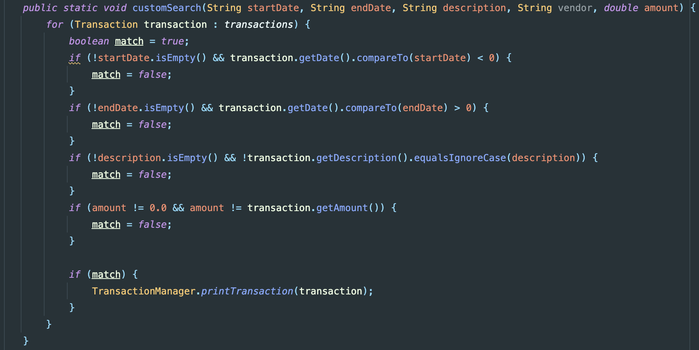

# Accounting Ledger

## Overview
The Accounting Ledger is an app that allows users to track their deposits in withdrawals.
Users can create custom queries to find specific charges in large datasets. 
## Features
- Add deposits
- Make payments (debits)
- Display all transactions
- Display deposits
- Display payments
- Generate reports with the following filters:
    - Month to date
    - Previous month
    - Year to date
    - Previous year
    - Search by vendor
    - Custom search

## Project Structure
- `src/main/java/com/pluralsight/accountingledger/`
- `FileIO.java`: Handles reading from and writing to the CSV file.
- `LedgerApplication.java`: The main class of the application.
- `Menus.java`: UI and menu navigation.
- `Prompts.java`: Text Prompts for user input.
- `Reports.java`: Generates financial reports based on specific queries chose by the user.
- `Transaction.java`: Defines a transaction.
- `TransactionManager.java`: Manages the list of transactions and provides utility methods.

- `src/main/resources/`
- `transactions.csv` : After writeToCSV is called the transaction is transferred to this csv file. 

## New Lessons Learned 
### Implementing Multiple Filters in Java

In the `Reports.java` file, the `customSearch` method practices implementing multiple filters when searching 
through a list of transactions. This method allows users to filter transactions based on start date, end date, 
description, vendor, and amount. The method searches through each transaction and checks if it matches all the provided
criteria. If a transaction meets all the conditions, it is printed out.

Key points learned:
- Using boolean flags to track if a transaction matches all criteria.
- Comparing dates using the `compareTo` method.
  - compareTo() method using integers returns a 0 if equal to, a number < 0 if less than, and a number > 0 if greater than.
  - In my boolean expressions I used these returns to decide if the chosen date was before or after the date of the transaction. 
  - If returned number is > 0 then the transaction is after the entered date (Start) and < 0 would be everything before the date (end date)
- Handling optional filters by checking if the input is empty before applying the filter.
- Parsing and comparing numerical values safely.

## What I would improve
While I strive for completion there is always more to improve. Exception handling is something that can be improved in 
this project there are numerous points for users to input information and with continuous testing more bugs will be identified
and updated.

Additionally, I can update the variable types for date and time to LocalTime and LocalDate, From collaborating with
my peers I noticed this late into my development process. This will be addressed in future updates to enhance the 
robustness of my program. 

